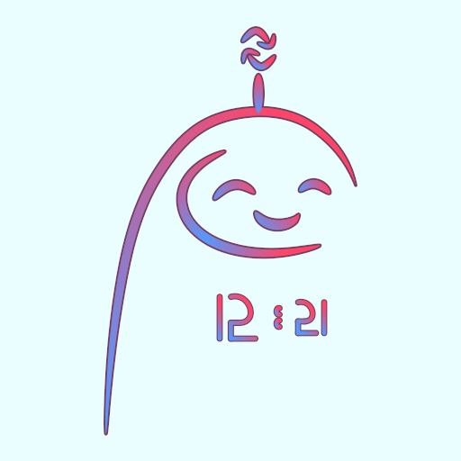

# Timofey Chuchkanov (crt0r) `(づ￣ ³￣)づ`
**Note that some other people on the Internet may occasionally have nicknames similar to mine.**

## AKA
- SGKz
- SGKz NJ

## About me
I'm just a sys- and netadmin college student who is also a programming otaku `┐(￣ω￣;)┌`.
I am obsessed with programming, even though still a programming newbie.

Have been learning a bit of web development since ~June, 2021.

### GitLab profile

### My profiles in other communities

### Contact info

## OSS Projects
### Sufflain

Since May, 2021 I hack on my first real-world open source project - [Sufflain](https://github.com/Sufflain-Open-Source). I have started this web application development because I wasn't satisfied with the UX of my college's site—our students use it mainly to see timetables.

### Super-secret non-released (yet) project
Recently decided to build a desktop productivity application for the Linux platform. Opted to go with [Tauri](https://tauri.studio/), so now I am also learning a bit of 🦀Rust. As soon as an ability to program in that awesome language emerge, the development will begin.

## Programming Languages
### Most proficient with

 
 

 
 

 
 

### Recently started learning

### Also tried a bit of

<!--
**crt0r/crt0r** is a ✨ _special_ ✨ repository because its `README.md` (this file) appears on your GitHub profile.

Here are some ideas to get you started:

- 🔭 I’m currently working on ...
- 🌱 I’m currently learning ...
- 👯 I’m looking to collaborate on ...
- 🤔 I’m looking for help with ...
- 💬 Ask me about ...
- 📫 How to reach me: ...
- 😄 Pronouns: ...
- ⚡️ Fun fact: ...
-->
